# LEVEL 0 REPORT (Generic Tasks)
## Task 1: 3D Printing
 A 3D printer is a machine that makes real, physical objects from a digital design. It builds the object layer by layer, just like stacking many thin sheets on top of each other until a full object is formed.  
 It is like a glue gun controlled by a computer. The printer melts plastic and places it very carefully to create shapes.
>### How Does a 3D Printer Work?
1. First, you create or download a 3D model on a computer.
2. The file is saved as an STL file (this file tells the printer the shape of the object).
3. The STL file is put into a software called a slicer (like Ultimaker Cura or Creality Slicer).
4. The slicer converts the design into instructions (called G-code).
5. The printer reads these instructions and starts printing layer by layer.

Most commonly, a plastic called **PLA**  (Poly-Lactic Acid) is used.
**It is made up of corn and sugarcane.**
It comes as a long plastic wire called filament.
The printer heats it, melts it, and pushes it out through a tiny nozzle.
>Important Settings
- **Nozzle Temperature** – How hot the plastic is melted.
- **Bed Temperature** – How warm the base plate is (helps the object stick).
- **Infill Densit**y – How solid the object is inside (more % = stronger but heavier).
- **Layer Height** – Thickness of each layer (smaller layers = smoother finish).
- **Print Speed** – How fast the printer moves.

I used tinkercad to create a 3d apple design.

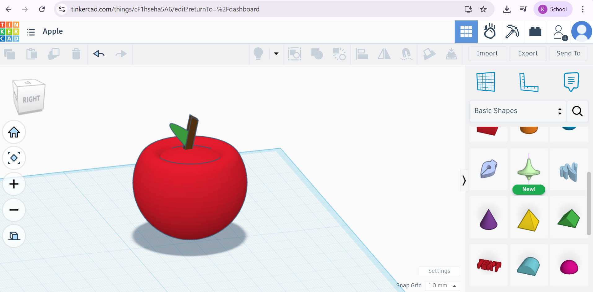
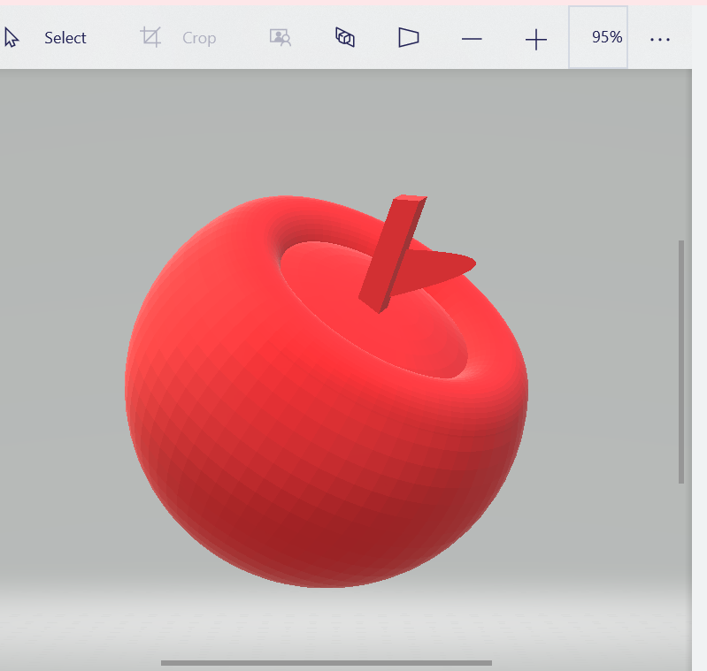

>[Apple](https://www.tinkercad.com/things/cF1hseha5A6-apple?sharecode=LyWaQOz7ln0ftmk5gXPhJNDOmwKU5yYRWcNgV-GUHy0)

## Task 2: API
An **API (Application Programming Interface)** is a set of rules that allows two software applications to communicate with each other.  

It works like a waiter in a restaurant:  
- You (the user) send a request.  
- The API sends the request to the server.  
- The server processes it and sends back a response.  
- The API delivers the response to you.  

I created a shopping web application using the Fake Store API and chatgpt.
The app fetches product data from the API and displays the products dynamically on the webpage.
#### The application uses:
- **HTML** for structure
- **CSS** for styling
- **JavaScript** for API calls and functionality.

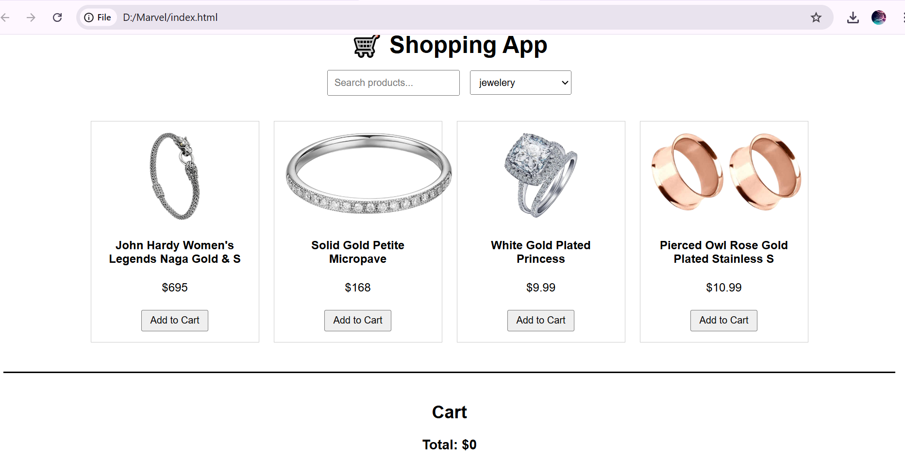

>Link:  [Open Shopping App](Marvel/index.html)

## Task 3: Working with GitHub
In  this task i had learnt how to fork a repository, clone it in my pc, then
create a new branch:
> git checkout -b new_b

Add and commit the changes:

> git add .

> git commit -m "Fix failing test in main.py"

Push to github:
> git push -u origin new_b

Finally, we have to compare and pull request i.e., it compares with the original branch and tell it to pull(take) the changes made into it.

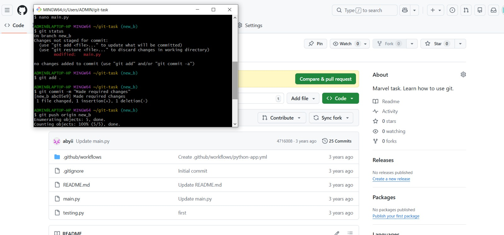

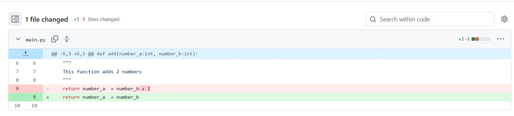

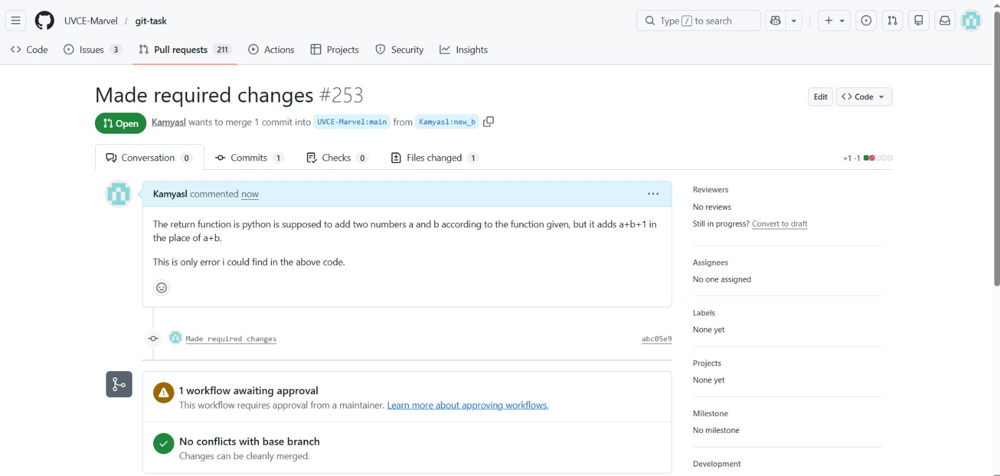


## Task 4:  Command line on ubuntu

Ubuntu is a free and open-source operating system based on the Linux, used in computers, servers, and development environments. It provides both a graphical interface and a Command Line Interface (Terminal) where users type commands to perform tasks.

Basic Ubuntu Commands that i have learnt:

- `mkdir` (make directory) – Creates a new folder.
- `cd` (change directory) – Moves into a folder.
- `touch` – Creates a blank file without using a text editor.
- `ls` (list) – Displays files and folders in the current directory.
- `cat` (concatenate) – Displays or combines file contents.
- `echo` – Prints or writes text into a file.
- `for` loop – Repeats commands multiple times (e.g., creating many folders).

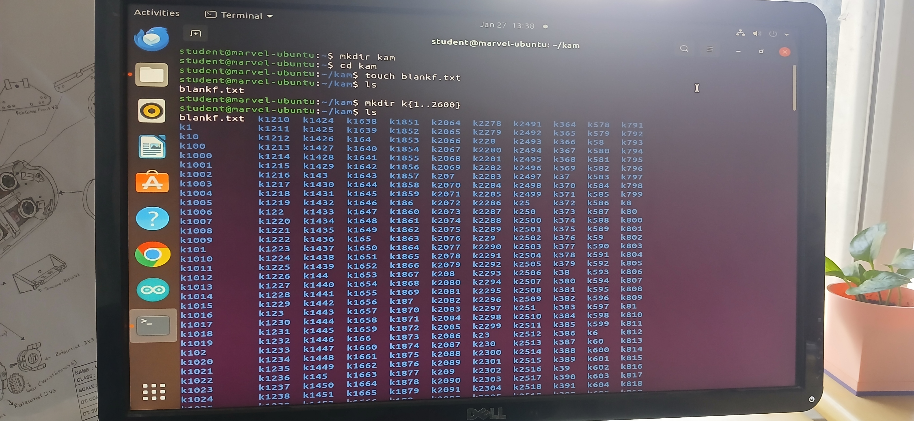

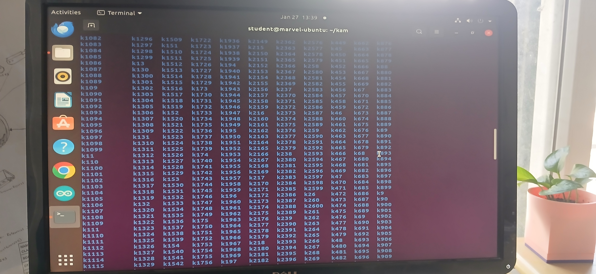

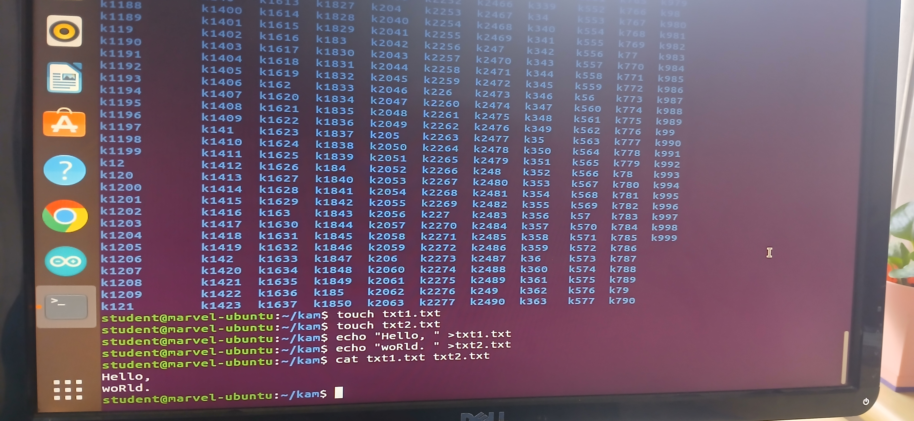

## Task 5: 

## Task 6: 

## Task 7: Create a Portfolio Webpage

I created a personal portfolio website to display my education details, interests, and projects. The website has a modern dark theme with simple animations and different sections like Home, About Me, Projects, and Contact. It is responsive, so it works well on both mobile phones and computers. I used HTML, CSS, and JavaScript to build the website. I also took the help of ChatGPT to guide me in designing and improving the website.

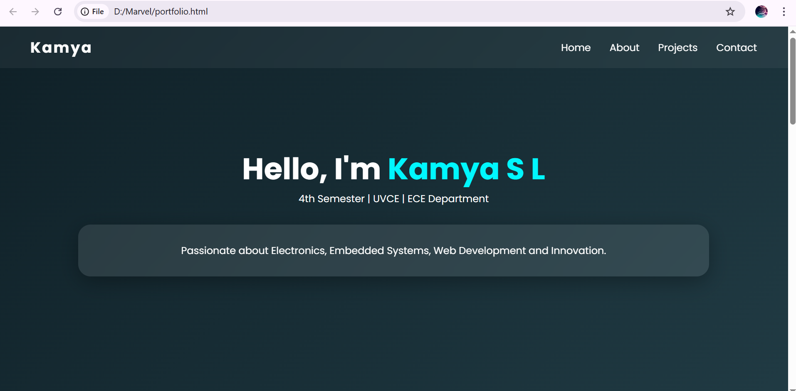

[View My Portfolio Website](Marvel/portfolio.html)

## Task 8: Writing Resource Article using Markdown

### Introduction to Markdown

Markdown is a simple way to format text using plain typing. It helps you add headings, bold words, lists, links, images, and code without using complicated HTML tags. You just use easy symbols like `#` or `*` to style your text. It works the same on different devices and platforms, which makes it very useful.

>Some basic Markdown syntax includes:

- `#` is used to create headings  
- `**text**` is used to make text bold  
- `*text*` is used to make text italic  
- `-` or numbers (`1.`, `2.`) are used to create lists  
- `[Link Name](URL)` is used to add hyperlinks  
- `` is used to add images  
- `` `code` `` is used for inline code  
- Triple backticks (```) are used for writing larger code blocks  


Markdown is popular because it is easy to learn and does not need any special software. 

Here is my resource article:
[Resource Article](Marvel/resourceArticle.md)

## Task 9: Tinkercad

I explored **Tinkercad**, an online circuit simulation platform developed by Autodesk, which allows users to design and test electronic circuits virtually. I became familiar with the interface, components, and example circuits available on the platform.

### Ultrasonic Distance Measurement
I simulated a circuit using an **Arduino Uno** and an **HC-SR04 Ultrasonic Sensor** to measure the distance between the sensor and an obstacle. The sensor emits ultrasonic waves and calculates the distance based on the time taken for the echo to return. The measured distance was displayed on the Serial Monitor.

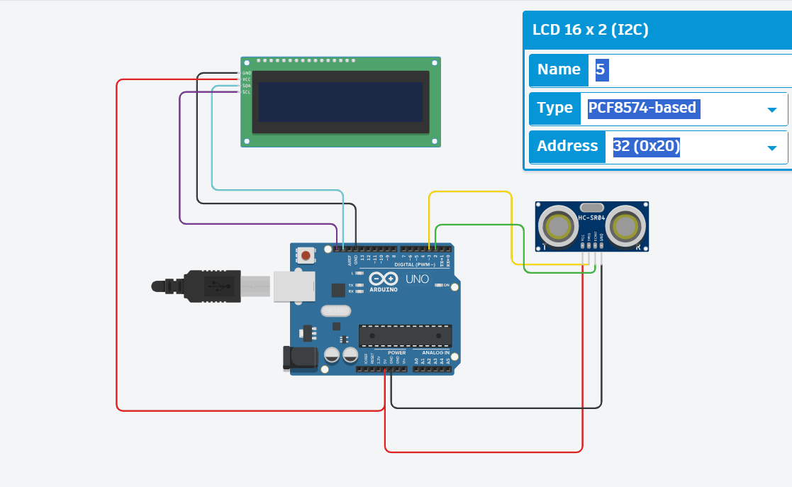
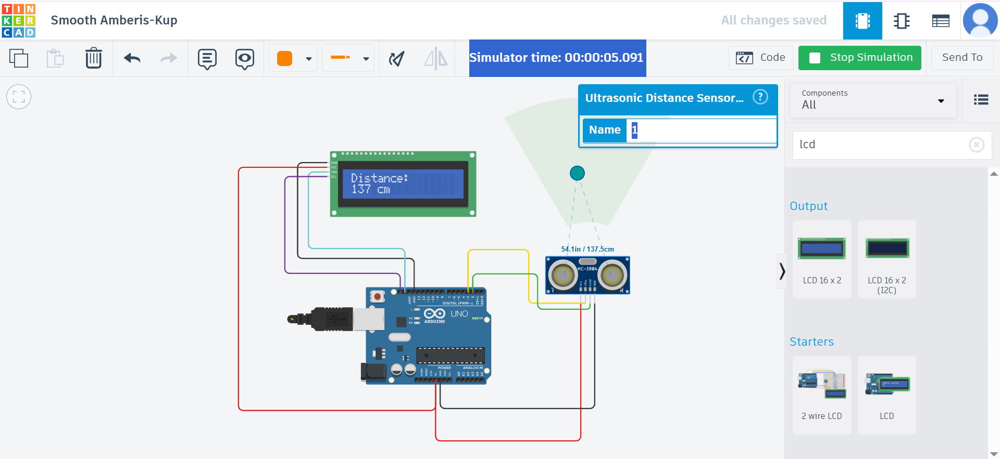
[Ultrasonic Distance Measurement](https://www.tinkercad.com/things/45XvJmdACfR-detector-circuit?sharecode=rD9Sk7wDg9V4W5vk4F7LEP3ZhZEgWngd9kKk8zbs7DU)

### Radar System Simulation
I created a simple radar system using the **HC-SR04 Ultrasonic Sensor** and a **Micro Servo** connected to the Arduino Uno. The servo motor rotates the sensor from **0° to 180°**, allowing it to scan a wider area and detect objects within a certain range.

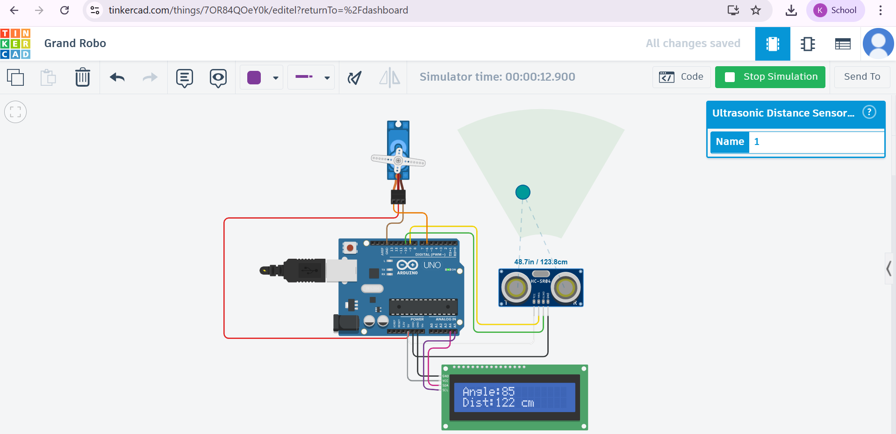
[Ultrasonic Distance Measurement](https://www.tinkercad.com/things/7OR84QOeY0k-grand-robo?sharecode=zjEldE66Osw4SQ6YAvzJUcBATA4ZrQz24x9jV4rF1jA)

Through this activity, I gained an introduction to Tinkercad, the working of an ultrasonic sensor and a servo motor, and the basic concept of radar technology.

No special precautions were required as the circuit was simulated in Tinkercad.

## Task 10: Speed Control of DC Motor

A **DC motor** rotates when DC voltage is applied.  

- **Direction Control** → Achieved using an **H-Bridge** circuit.  
- **Speed Control** → Achieved using **PWM (Pulse Width Modulation)** from Arduino.  

The **L298N Motor Driver** acts as an interface between Arduino and the motor because:
- Arduino cannot supply enough current directly.
- L298N can handle higher current and voltage.


### Working Principle  

- IN1 & IN2 → Control motor direction  
- ENA → Controls motor speed (connected to PWM pin)  
- PWM value (0–255) → Adjusts motor speed


| IN1 | IN2 | Motor Direction |
|------|------|----------------|
| HIGH | LOW  | Forward        |
| LOW  | HIGH | Reverse        |
| LOW  | LOW  | Stop           |


## Conclusion  

The experiment demonstrated how an **Arduino UNO with L298N motor driver** can efficiently control the speed and direction of a DC motor using PWM and H-Bridge logic.  

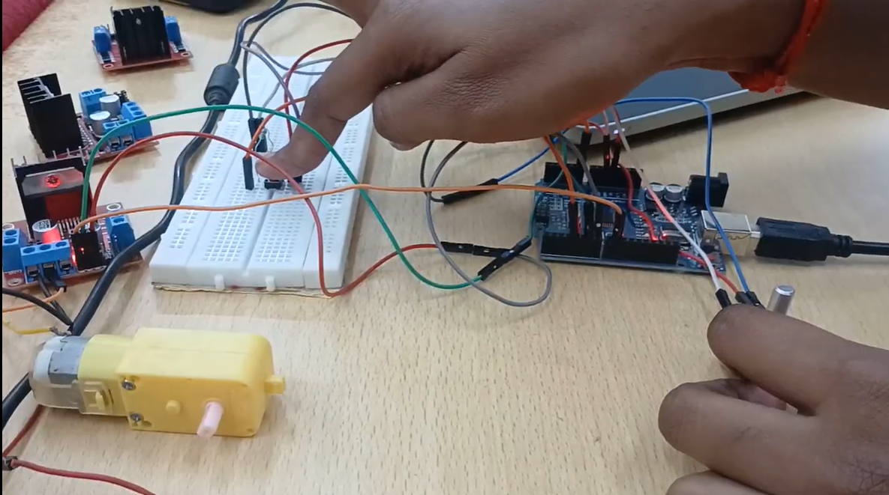
[Video:  Speed control of DC Motor](https://www.youtube.com/watch?v=gWdM7v4HYEQ)

## Task 11: LED Toggle

The ESP32 is a small microcontroller with built-in Wi-Fi that can create its own simple website. 

In this task, we set up the Arduino IDE to support ESP32, wrote a program, and uploaded it to the board. An LED was connected to one of its GPIO pins. When the ESP32 connects to Wi-Fi, it shows a webpage with buttons to turn the LED ON and OFF. By opening the ESP32’s IP address in a browser and clicking the buttons, the LED can be controlled wirelessly. 

We learnt how ESP32 can be used for basic IoT projects.

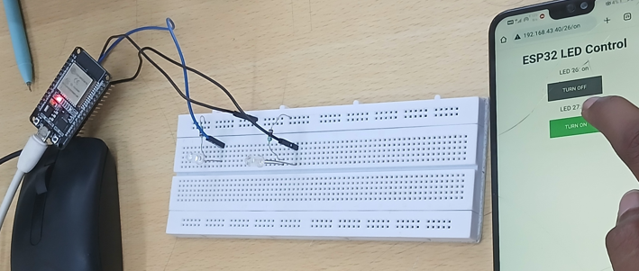
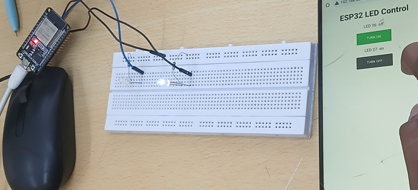
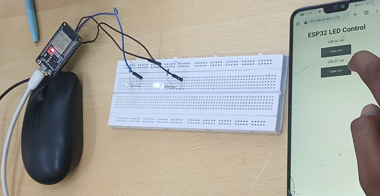
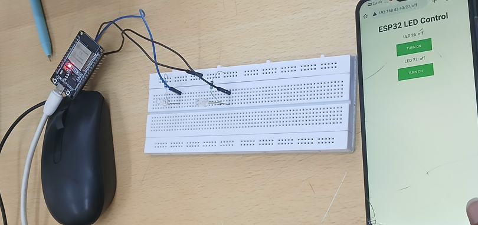

[Video: Led Toggle ](https://www.youtube.com/shorts/RSssbwJHVxM)

## Task 12: Soldering Prerequisites

In this task, I learned about the soldering equipment available in the lab, including the soldering iron, solder wire, flux, and soldering wick. I understood the purpose of each tool, such as using flux to improve solder flow and soldering wick to remove excess solder.

 Under the supervision of a coordinator, I practiced basic soldering techniques and soldered an LED onto a perf board.
 
  This activity helped me understand proper heating, applying solder correctly, and ensuring strong and neat electrical connections while following safety precautions.

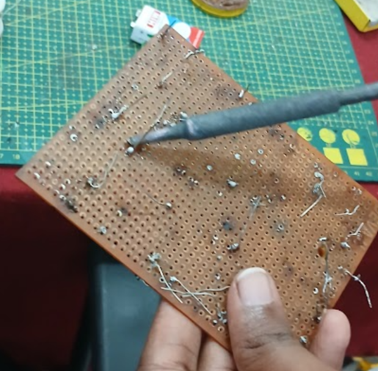
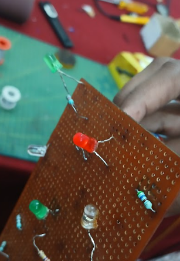

## Task 13:555 astable Multivibrator

To design a 555 timer in astable mode with a duty cycle of 60%, assemble the circuit on a breadboard, and observe the output waveform using a Digital Storage Oscilloscope (DSO).

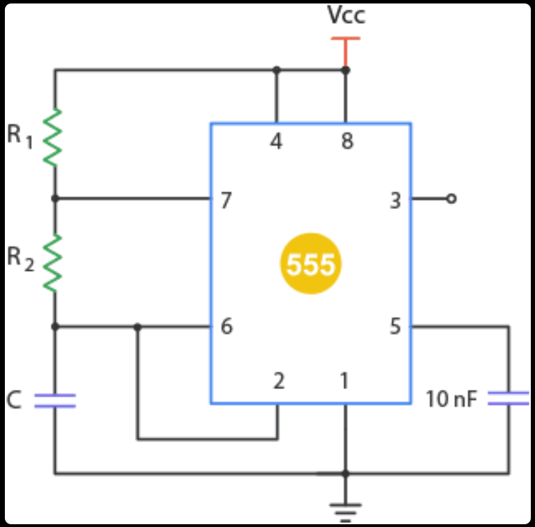

In this task, a 555 timer IC was configured in astable mode to generate a continuous square wave. The resistor and capacitor values were selected to achieve approximately 60% duty cycle using the astable mode duty cycle formula. The circuit was assembled on a breadboard with proper power supply connections and timing components. After powering the circuit, the output was connected to the DSO probe to observe the waveform. A square wave was successfully observed, and the high and low time intervals confirmed an approximate 60% duty cycle. 

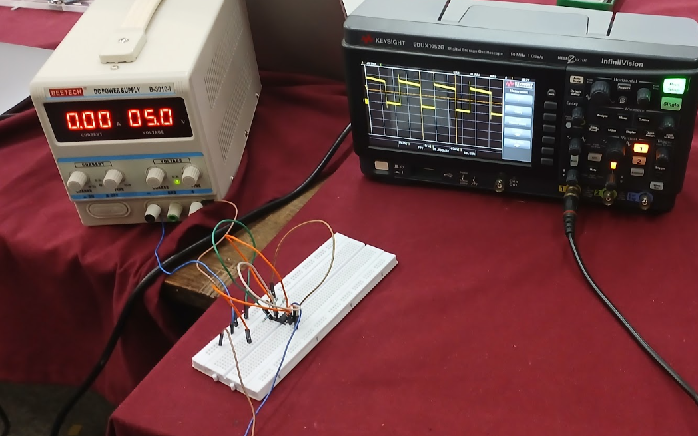
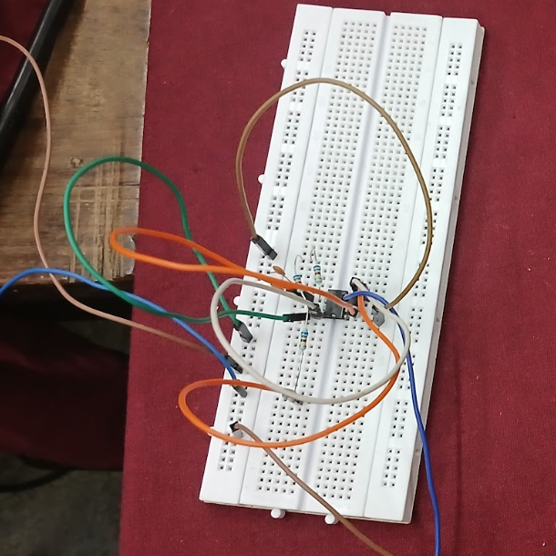


This experiment helped in understanding pulse generation and timing control using the 555 timer IC.


## Task 14: Karnaugh Maps

In this task, four possible cases were considered based on two inputs: Door (Open/Closed) and Key (Pressed/Not Pressed). 

Using the knowledge gained from DLIC, I constructed a truth table and then plotted the corresponding 2-variable Karnaugh Map to simplify the Boolean expression. From the simplified expression, I derived the required logic circuit using basic gates. The circuit was implemented using push buttons to represent the door and key conditions. When the door was opened without the key being pressed (unauthorized condition), the output activated a buzzer/LED to indicate an alarm. This experiment helped me practically apply K-Map simplification and implement a real-world logic-based security system.

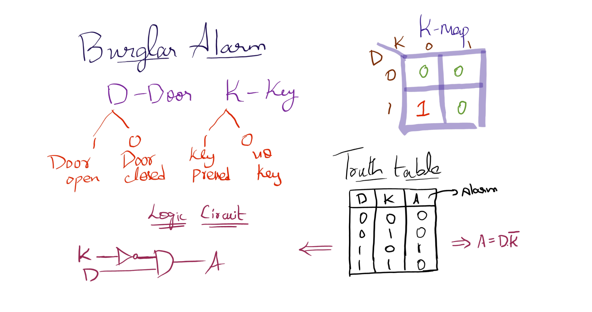


## Task 15: Active Participation
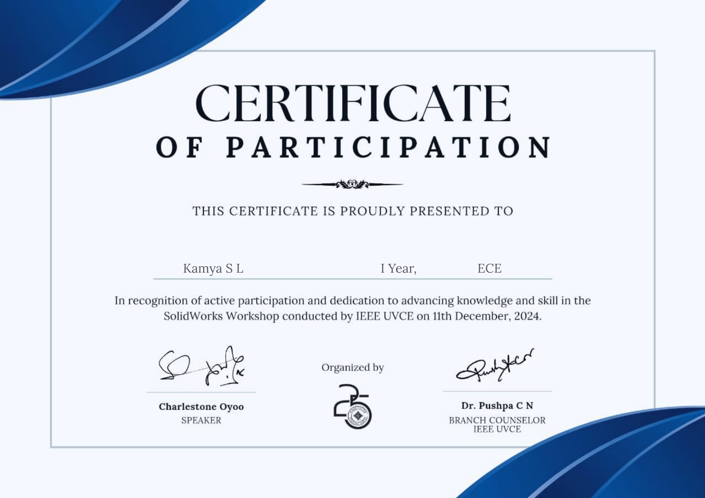

## Task 16: Datasheets report writing

[L293D Motor Driver IC](Marvel/L293D.md)
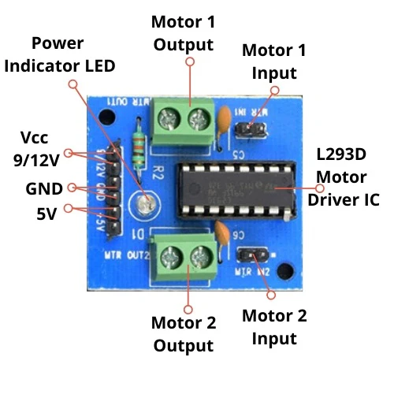
[MQ135 Gas sensor](Marvel/MQ135.md)
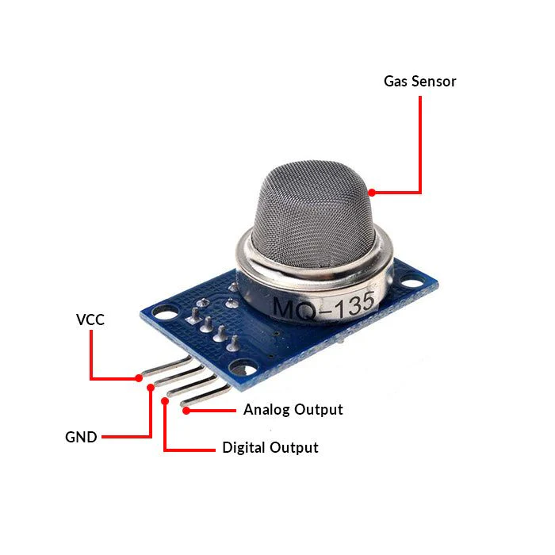


## Task 17: Introduction to VR

I experienced virtual reality, and then learnt about it. I also learnt the differences between VR and AR, the trends in the space and technology stack being developed.

- Virtual Reality (VR) is a technology that creates a completely computer-generated 3D world that you can experience using a VR headset, making you feel like you are inside that digital environment. It blocks the real world and replaces it with a virtual one where you can look around and interact with objects. 

- Augmented Reality (AR), on the other hand, does not replace the real world but adds digital elements (like images or information) on top of what you see around you using a phone or smart glasses.

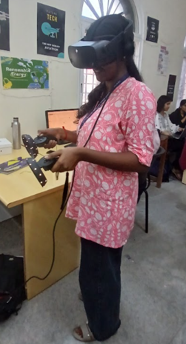


## Task 18: Sad servers

SadServers is a platform similar to “LeetCode for Linux” where users solve real-world Linux troubleshooting challenges. 

In the “Command Line Murders” scenario, I used various Linux commands to investigate and solve a murder mystery through the terminal. 

I practiced the following Linux commands during the activity:

- **ls** – Lists the files and directories in the current folder.  
- **cd** – Changes the current directory.
- **cat** – Displays the contents of a file.  
- **grep** – Searches for specific words or patterns inside files.  
- **find** – Searches for files and directories based on name or conditions.  
- **less** – Views file content page by page, useful for large files.  

This task helped me improve my command-line skills, logical thinking, and problem-solving ability while working entirely in a Linux environment.

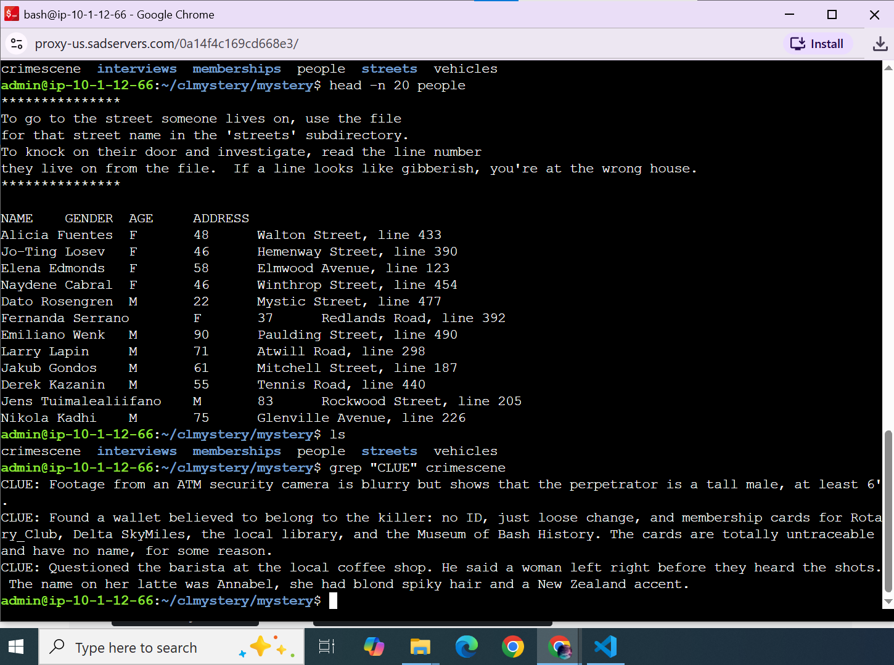
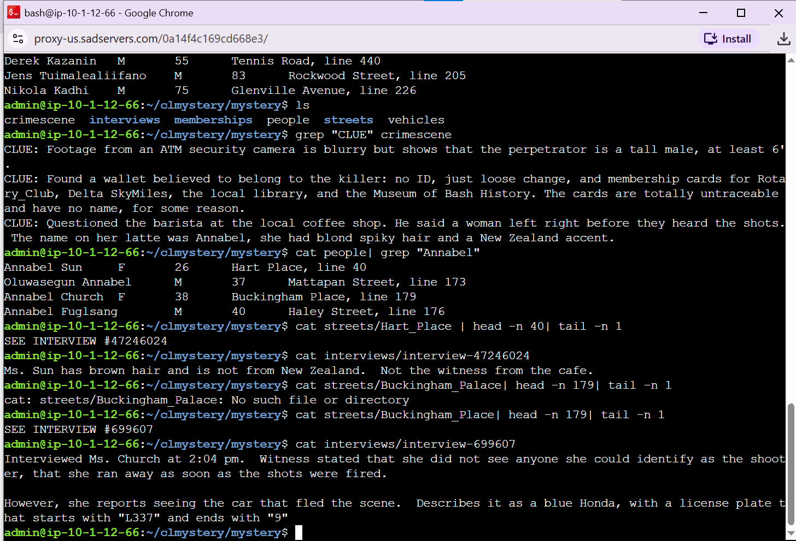
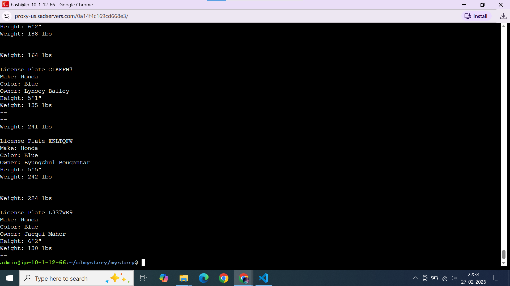
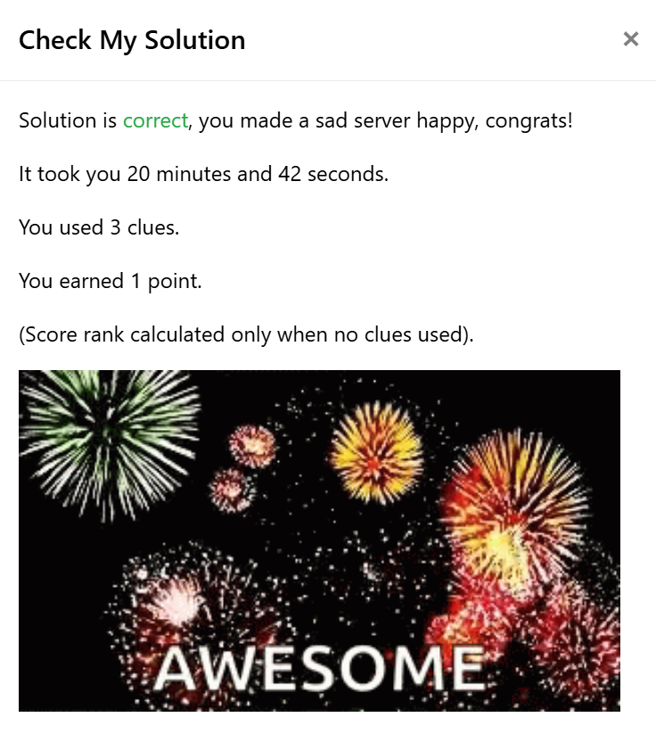


## Task 19:


